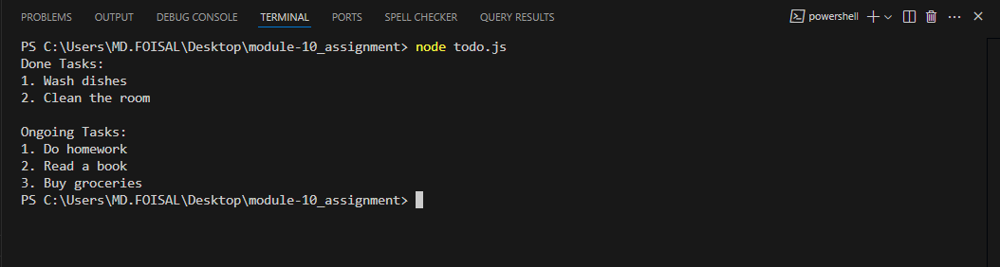

# Basic Todo List with Status Filter

A simple JavaScript-based console project that categorizes todos into two sections: **Done** and **Ongoing**. This project is built using plain JavaScript, without any HTML or browser-based input.

---

## Output Screenshot



---

## Task Table

| Done Tasks     | Ongoing Tasks |
| -------------- | ------------- |
| Wash dishes    | Do homework   |
| Clean the room | Read a book   |
|                | Buy groceries |

---

## Step-by-Step Explanation

### Step 1: Create an array of todo items

We create a list of task objects. Each object has:

- `title`: name of the task
- `done`: `true` if completed, `false` if ongoing

### Step 2: Filter the tasks

We use JavaScript's `filter()` function to separate the tasks into two categories:

- Done tasks → where `done === true`
- Ongoing tasks → where `done === false`

### Step 3: Display the tasks

We use `console.log()` and `forEach()` to print each task under the correct section in the terminal.

---

## System Requirements

| Requirement | Version                            |
| ----------- | ---------------------------------- |
| Node.js     | v14 or higher                      |
| OS          | Windows/Linux/Mac                  |
| Terminal    | Any terminal that supports Node.js |

---

## How to Run This App

1. **Clone this repository:**

   ```bash
   git clone https://github.com/Md-Foisal/module-10_assignment.git
   ```

2. **Navigate into the folder:**

   ```bash
   cd todo-status-filter
   ```

3. **Run the JavaScript file using Node.js:**
   ```bash
   node todo.js
   ```

---

**Thank you!** This project demonstrates how to organize and filter task data using core JavaScript only.
